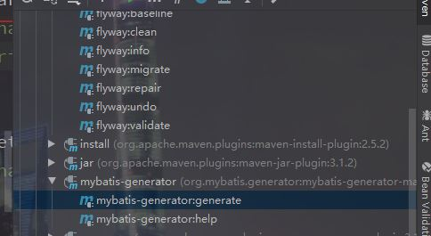

## 逆向工程  
逆向工程配置文件   
```<?xml version="1.0" encoding="UTF-8"?>
<!DOCTYPE generatorConfiguration
        PUBLIC "-//mybatis.org//DTD MyBatis Generator Configuration 1.0//EN"
        "http://mybatis.org/dtd/mybatis-generator-config_1_0.dtd">

<generatorConfiguration>
    <context id="DB2Tables" targetRuntime="MyBatis3">
        <plugin type="org.mybatis.generator.plugins.ToStringPlugin" />
        <jdbcConnection driverClass="com.mysql.cj.jdbc.Driver"
                        connectionURL="jdbc:mysql://localhost:3306/gourdmall"
                        userId="gourdmall"
                        password="123456">
        </jdbcConnection>

        <javaTypeResolver >
            <property name="forceBigDecimals" value="false" />
        </javaTypeResolver>

        <javaModelGenerator targetPackage="com.hlz.gourdmall.model" targetProject="src/main/java/">
            <property name="enableSubPackages" value="true" />
            <property name="trimStrings" value="true" />
        </javaModelGenerator>

        <sqlMapGenerator targetPackage="mapper"  targetProject="src/main/resources">
            <property name="enableSubPackages" value="true" />
        </sqlMapGenerator>

        <javaClientGenerator type="XMLMAPPER" targetPackage="com.hlz.gourdmall.mapper"  targetProject="src/main/java">
            <property name="enableSubPackages" value="true" />
        </javaClientGenerator>
        <table tableName="user" domainObjectName="User"/>
        <table tableName="check_code" domainObjectName="CheckCode"/>
        <table tableName="token" domainObjectName="Token"/>
        <table tableName="category" domainObjectName="Category"/>
        <table tableName="product" domainObjectName="Product"></table>
    </context>
</generatorConfiguration>
```
  
第一步先有执行表  
第二步执行maven的逆向工程  
强大的东西